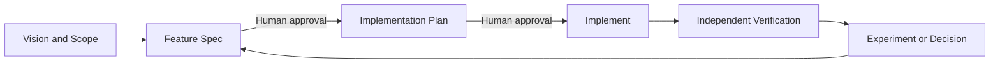

# Spec-Driven Harness Starter

GitHub Copilot in VS Code を使い、仮説から検証証跡までを追跡しながら
小さく実装するための、言語・フレームワーク非依存スターターです。

## Development Loop



各機能は `REQ-###` と `AC-###` を起点に、計画、テスト、検証証跡まで
追跡します。エージェント間の handoff は自動送信せず、人間が成果物を
確認してから次の段階へ進みます。

## Quick Start

1. [Vision](docs/01_vision.md) と [Scope](docs/02_scope.md) を更新します。
   - 01_vision.mdなどの既存ファイル をテンプレートとしてGitHub Copilotと協業して仕様を作成することをお勧めします。
2. [Feature spec template](docs/specs/feature-spec.template.md) をコピーし、
   `docs/specs/<feature-name>.md` として要求と受入条件を定義します。
   - ①と同じく、既存のテンプレートを使い、GitHub Copilotと協業して仕様を作成することをお勧めします。
3. VS Code Chat で `Spec` agent または `/define-feature` を使い、仕様を
   Ready にします。
4. `Plan` agent で実装計画を作成し、人間が承認します。
5. `Implement` agent で承認済み範囲を実装します。
6. `Verify` agent で要求カバレッジと実行証跡を独立確認します。
7. 判断や学びを [Decisions](docs/05_decisions.md) または
   [Experiments](docs/04_experiments.md) に追記します。

ローカル検証:

```bash
python -m unittest discover -s tests -p "test_*.py"
python scripts/validate_starter.py
```

## Harness Components

| Component | Location | Responsibility |
| --- | --- | --- |
| Always-on rules | `.github/copilot-instructions.md` | 全作業の最小契約 |
| File instructions | `.github/instructions/` | Markdown と追跡規約 |
| Custom agents | `.github/agents/` | Spec、Plan、Implement、Verify の権限分離 |
| Agent Skills | `.github/skills/` | 反復可能な専門ワークフロー |
| Prompt files | `.github/prompts/` | 各フェーズの薄い起動入口 |
| Specifications | `docs/specs/` | 要求と受入条件の正本 |
| Plans | `docs/plans/` | 実装順序と検証戦略 |
| Verification | `docs/quality/` | 実行結果、証跡、残存リスク |
| Validator | `scripts/validate_starter.py` | 構造と customization の決定論的検査 |

アプリケーションのソースコードは `/src` 配下に作成します。テストは
`/tests`、ハーネス用スクリプトは `/scripts`、文書は `/docs`、リポジトリ
設定と Copilot customizations は `/.github` に配置します。

## Compatibility

- 主対象は GitHub Copilot in VS Code です。
- Agent Skills は Copilot CLI と Copilot coding agent でも再利用できる
  標準形式を使います。
- Hooks は Preview 機能のため既定では有効にしません。opt-in 例は
  [examples/hooks](examples/hooks/README.md) にあります。
- `AGENTS.md` は `.github/copilot-instructions.md` との二重管理を避ける
  ため含めていません。

## Diagnostics

VS Code で `Chat: Open Customizations` を実行し、Diagnostics から
instructions、agents、skills、prompts の読み込みエラーを確認します。
Preview 機能は VS Code の更新で仕様が変わる可能性があるため、導入前に
公式ドキュメントを再確認してください。

## Scope

このスターターは仕様工程と軽量な検証ハーネスを提供します。特定言語の
ソース雛形、クラウド IaC、MCP サーバー、生成 AI 専用評価基盤は含みません。
利用プロジェクトの技術スタックが決まった時点で、必要な instructions と
検証コマンドを追加してください。
