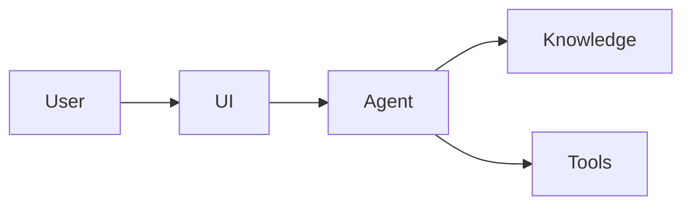

# High-Level Architecture

## Overview

システム全体を高いレベルで説明します。  
正確さよりも「意図の共有」を重視します。

## Architecture Diagram (Optional)

## Data Sources

- ドキュメント（PDF、SharePoint、GitHub など）
- 構造化データ（DB、API など）

## AI Components

- 利用する LLM
- RAG 構成の有無
- ツール呼び出し・関数

## Security Notes (Light)

- 認証・認可の前提
- データアクセス範囲
