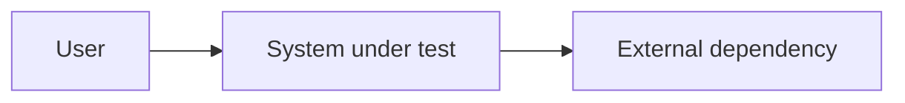

# Architecture

## Context

システム境界、利用者、外部システムを記載します。図の各要素は下の責務表と
同じ名前を使います。

## Components

| Component | Responsibility | Owns | Must not own |
| --- | --- | --- | --- |
| `<name>` | `<単一の責務>` | `<データまたは判断>` | `<境界外の責務>` |

## Data Flow

| Data | Source | Destination | Classification | Retention |
| --- | --- | --- | --- | --- |
| `<data>` | `<source>` | `<destination>` | `<public/internal/sensitive>` | `<期間>` |

## External Dependencies

| Dependency | Contract | Failure behavior | Test substitute |
| --- | --- | --- | --- |
| `<service>` | `<API、schema、version>` | `<timeout、fallback>` | `<fake、fixture、none>` |

## Trust Boundaries

- Authentication: `<主体を確認する場所>`
- Authorization: `<操作を許可する場所>`
- Input validation: `<信頼できない入力を検証する場所>`
- Secret handling: `<保存せず参照する方法>`

## Failure Modes and Observability

| Failure mode | User-visible result | Detection evidence | Recovery |
| --- | --- | --- | --- |
| `<failure>` | `<observable behavior>` | `<log、metric、test>` | `<retry、fallback、manual>` |

## Quality Attributes

| Attribute | Scenario and threshold | Related requirement |
| --- | --- | --- |
| `<quality>` | `<条件と観察可能な閾値>` | `REQ-###` |

## Decisions and Open Questions

- Related decisions: [Decision Log](05_decisions.md)
- [ ] `<実装前に解決すべきアーキテクチャ上の質問>`
